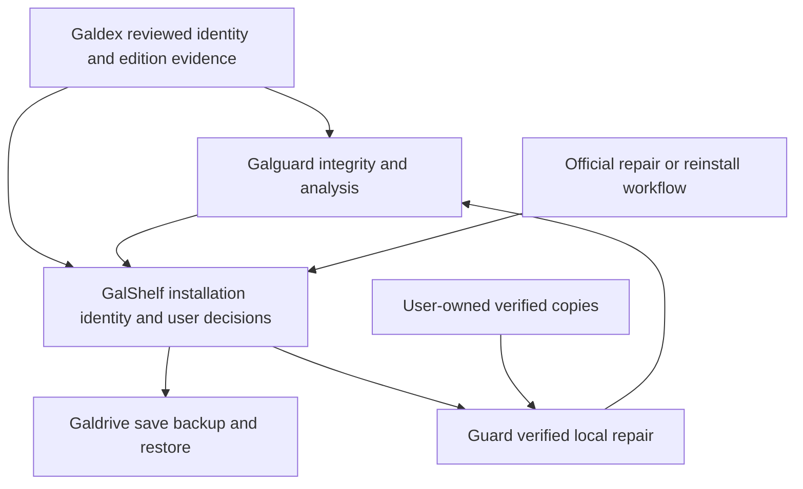

# Galguard Future Development Guide

**Revision:** 1.0 proposal · **Research date:** 2026-10-02 · **Status:** development guidance, not a release announcement

[Current Galguard capabilities](../GALGUARD.md) · [Galdex](../GALDEX.md) · [Galdrive](../GALDRIVE.md) · [GalShelf](../README.md)

## 中文导读

Galguard 的长期价值是：知道安装文件发生了什么变化、提供有依据的风险解释、协助保留存档并恢复可核验的安装状态。身份识别、完整性、安全扫描和恢复能力必须分别表达，不能用“识别成功”代替安全判断。

本指南审核并扩展了主动防护讨论，纠正了四点：哈希一致不代表无毒；目录监听不是写入前拦截；已有压缩包不一定能只下载一个组件；Galdrive 当前是存档工具，不能直接当作游戏本体恢复网络。优先完成可靠变化检测、补丁变更记录、启动前检查与本地事务式修复，再评估系统防护、行为观测和隔离运行。

无需先建立全游戏文件服务器。采用“本地详细基准＋Galdex 少量经审核的身份锚点＋按需版本清单”，先利用用户已有副本和官方修复渠道。没有可信替代文件时，应明确提示无法自动修复。社区文件分发、官方镜像、自研内核驱动均属于后续独立决策。

下文英文正文是供开发与验收使用的完整规范，包括架构、数据契约、恢复事务、技术选型、成本模型、验收矩阵和里程碑。所有计划、示例接口、性能目标与工期都是提案，不代表已实现或已承诺发版。

## 1. Purpose and decision summary

Build a game-aware integrity and recovery companion that helps a player answer:

1. Which installation and edition am I looking at?
2. What changed, relative to which accepted baseline?
3. What evidence supports a security concern, and what was not checked?
4. Can I recover the intended state without damaging saves or legitimate patches?

Preserve Guard's own analysis engine, reversible quarantine and existing launch barriers. Microsoft Defender remains an optional supplement. Do not reduce Guard to a hash lookup, and do not present it as a replacement for a maintained antivirus product.

The recommended next increment is **reliable change detection, patch-aware review and verified local recovery**. Continuous monitoring improves detection latency; it does not by itself prevent writes. Strong containment is a separate capability with separate compatibility and maintenance costs.

This guide is sufficient to scope implementation work, but does not authorize changes to production security settings, a driver installation, a new distribution service or a release. Each implementation must preserve existing security and save-recovery barriers and pass its milestone gates.

## 2. Evidence baseline and existing work

The public documentation snapshot used for this review is commit [`66f3a9f`](https://github.com/Harihi-Works/GalShelf-Dev/tree/66f3a9f1c56ca64d05f4cc6cccf0e4bffef72511). Its README names GalShelf 0.2.7 as the current beta and explicitly retains some 0.2.6 feature descriptions. Guard is described as a separate 0.1.0 prerelease. Do not infer a Guard upgrade from the GalShelf version number.

| Area | Publicly documented baseline | Work proposed here |
| --- | --- | --- |
| Guard | Confirmed file lists, change checks, own analysis rules, reversible quarantine and verified local repair | Continuous reconciliation, explicit coverage, patch transactions, recovery readiness |
| GalShelf | Optional Guard integration and its own launch-file change warnings | Consistent evidence presentation and coordinated launch/repair operations |
| Galdex | Maintainer tool for reviewed, signed identity fingerprints and save-location rules | Optional edition manifests and provenance extensions, with separate review |
| Galdrive | Save backup, version history, conflict handling and restoration | Save preservation around repair; no implicit game-binary transport |

These are documentation claims, not a fresh binary certification or an exhaustive source-code audit. Milestone M0 must reproduce the relevant behavior against exact executable and source versions before extending it. Reuse existing scanning, identity, quarantine and repair components; do not implement a second independent security state machine.

Stable baseline references: [Guard](https://github.com/Harihi-Works/GalShelf-Dev/blob/66f3a9f1c56ca64d05f4cc6cccf0e4bffef72511/GALGUARD.md), [Galdex](https://github.com/Harihi-Works/GalShelf-Dev/blob/66f3a9f1c56ca64d05f4cc6cccf0e4bffef72511/GALDEX.md), [Galdrive](https://github.com/Harihi-Works/GalShelf-Dev/blob/66f3a9f1c56ca64d05f4cc6cccf0e4bffef72511/GALDRIVE.md).

## 3. Review of the original concept

| Original idea | Assessment | Development decision |
| --- | --- | --- |
| A hash can indicate whether a file changed or contains a virus | It can establish equality to known bytes; malware classification needs independently supported evidence | Keep integrity, identity and scanner findings separate |
| First scan establishes a trusted installation | A first scan can baseline an already compromised copy | Record a user-accepted baseline with provenance; never call it certified safe |
| A fingerprint match means a trusted game | The same work has multiple editions; shared runtimes are ambiguous | Match file → edition/patch evidence → work; return ambiguity honestly |
| Modified files should be deleted | Legitimate patches and saves also change | Review or reversible quarantine; no automatic permanent deletion |
| Galdex needs every file from every game | Useful identity coverage can begin with a few discriminating anchors | Keep detailed personal manifests local; expand curated coverage selectively |
| Galdrive restores arbitrary game components | This exceeds its current save-only product boundary | Guard owns local program repair; Galdrive preserves saves |
| A watcher asks permission before a change | A notification generally describes a change that already occurred | Describe it as detection, with a reconciliation fallback |
| A new DLL means an attack | Overlays, translations and compatibility tools can add modules | Treat module changes as evidence requiring context |
| Community votes establish safety | Popularity is vulnerable to coordinated submissions | Review provenance, apply independent checks and support revocation |
| Community caching removes hosting cost | Storage and bandwidth still exist, distributed across participants | Defer binary sharing; first measure demand and rights constraints |
| A game's fingerprints always occupy a few KB | Size depends on file count, paths, editions and history | Use an explicit capacity model and actual corpus measurements |

Avoid unsupported claims of uniqueness, antivirus equivalence, universal game coverage or a numerical “98% safe” score. Explain concrete observations instead.

## 4. Product boundaries and architecture



| Component | Owns | Must not infer |
| --- | --- | --- |
| GalShelf | Installation identity, library UI, launch orchestration and user intent | A work match authorizes repair or clears a threat |
| Galguard | File evidence, analysis, integrity state, quarantine, repair plan and verification | An accepted baseline or valid signature proves harmlessness |
| Galdex | Reviewed work/edition anchors, save rules, dataset provenance | A dataset may execute commands, widen write paths or bypass policy |
| Galdrive | Save snapshots, conflicts, recovery and backend credentials | Game executables or arbitrary directories belong in save uploads |

An eventual program-package transport must be a separately reviewed provider contract. If it is later assigned to Galdrive, that requires an explicit product-scope change; current save permissions must never silently expand.

Keep scanners and archive parsers unprivileged. Introduce a narrowly scoped helper only if a demonstrated operation requires it. A local service must validate client identity/session, origin where applicable, paths and authorization; loopback binding or a fixed custom header alone is not authentication.

## 5. Threat model and protection limits

Protect installation integrity, personal saves, recovery copies, baseline history, signing trust roots, account credentials and user decisions.

| Threat | Intended response | Residual boundary |
| --- | --- | --- |
| Accidental corruption or interrupted patch | Identify changed/missing files; restore a verified state | Requires a suitable surviving copy |
| Untrusted executable, script or DLL | Independent scanner evidence, launch review, optional containment | Unknown malware can evade static rules |
| Baseline poisoning | Record source and acceptance separately; retain prior generations | A user can accept bad bytes; same-user malware may alter local data |
| Malicious archive or recovery path | Isolated staging, parser budgets, path and target checks | Parser vulnerabilities require updates and process isolation |
| Tampered or replayed metadata | Signature, version, expiry and revocation validation | Signing-key compromise requires a recovery process |
| Competing repair, launch or save operation | Installation-scoped coordination and revalidation | External programs may ignore application locks |
| Administrator/kernel compromise | Report inability to guarantee protection | Out of scope for a normal user-mode companion |

Do not promise immunity to ransomware or theft of browser credentials. A database hash chain may reveal accidental corruption; without an independently protected trust anchor it cannot defeat an attacker who can rewrite the database and chain together. Backups on the same writable disk are not an independent protection boundary.

## 6. Evidence and state model

Use orthogonal dimensions rather than one `trusted` flag:

| Dimension | Proposed values | Meaning |
| --- | --- | --- |
| Identity | unknown / candidate / matched / ambiguous | Which work and edition evidence applies |
| Integrity | unbaselined / unchanged / changed / incomplete | Comparison against a particular baseline generation |
| Analysis | not_scanned / no_indicators / suspicious / detected / error / unsupported | Result from a named engine and rule version |
| Recovery | unavailable / source_available / staged / applying / verified / rollback_required | Operational recovery state |
| Observation | current / stale / gap / paused | Whether the intended checks have adequate coverage |

These are proposed contract fields, not a replacement enum to insert blindly into existing databases. Provide a compatibility adapter for current health states.

Every finding records installation ID, relative path, old/new SHA-256 when available, size, baseline generation, scan time, engine/rule version, reason, coverage and unresolved errors. A scanner result is tied to the exact bytes checked and becomes stale when those bytes change. “No indicators” means only that the listed checks found none at that time.

Decision rules:

- Identity matches never clear security findings or accept new baselines.
- Accepting a known patch updates integrity expectations only after review; it does not waive an independent threat result.
- Timeout, missing engine, locked file or unsupported format produces incomplete coverage, never a clean result.
- Existing threat-blocking policy remains in force. Any exception must use the existing explicit, audited exception mechanism, never an ordinary “skip integrity check” switch.
- A repair is successful only after target-byte verification and the required independent analysis complete. Otherwise show `verification_required` or its current equivalent.
- UI examples: “3 files changed since your accepted baseline”; “Identity matched; security scan incomplete”; “No verified replacement is available.”

## 7. Baselines, identity and patch composition

### 7.1 Identity keys and ownership

Use a local `installation_id` for each installed copy; retain the VNDB work ID for work identity. A work ID alone is not an edition ID or a save-compatibility guarantee. Edition identity must include available platform/store, architecture, language, release and patch evidence. Unknown fields stay unknown.

Do not create a parallel public work-numbering system. Reuse canonical installation identity across applications, but keep data ownership explicit and avoid unsynchronized writes to another application's database.

### 7.2 Proposed manifest record

The following is illustrative JSON, not a deployed API or a trusted sample. All zeros are placeholders. Production validation must reject dummy or malformed identifiers and digests.

```json
{
  "schema_version": 1,
  "installation_id": "example-local-installation",
  "work_id": "v1",
  "edition_id": null,
  "baseline_generation": 1,
  "provenance": {"kind": "user_accepted_local", "review_status": "unreviewed"},
  "scope": {"profile": "launch_files", "complete_installation": false},
  "files": [{
    "relative_path": "game.exe",
    "role": "primary_executable",
    "size": 1234,
    "sha256": "0000000000000000000000000000000000000000000000000000000000000000",
    "required": true
  }],
  "patch_chain": [],
  "excluded_roles": ["save", "cache", "log"]
}
```

Version the serialization and hashing rules before signing manifests. Separate content records from signatures and local acceptance history. Enforce relative paths, size limits, unique normalized destinations and explicit roles. Windows drive paths, UNC paths, traversal, alternate data streams, reserved names and case-insensitive collisions must not become restore destinations.

Use signature verification as provenance evidence; a mere embedded certificate or signer name is insufficient. Windows provides policy-based verification through [WinVerifyTrust](https://learn.microsoft.com/en-us/windows/win32/api/wintrust/nf-wintrust-winverifytrust). Even a successfully verified publisher signature is not a malware-free certificate.

### 7.3 Patch transactions

Represent a patch as an ordered transform from an exact parent manifest to a target manifest, including expected before/after digests, additions, removals, source evidence and compatibility constraints. Two patches touching the same path require an explicit ordering or a conflict. Do not assume all translations of a work share one baseline.

Recommended flow: checkpoint saves → record prior baseline → capture proposed file diff → scan changed content → review expected changes → accept a new generation. Acceptance records who/what initiated it and retains the previous generation. No indefinite “maintenance mode” that silently trusts everything a patcher writes. Unauthorized concurrent changes remain findings.

## 8. Efficient scanning and reliable monitoring

1. Start with launch executables, adjacent loadable modules, scripts and explicit high-value paths. Offer a separate full-installation verification profile; clearly show excluded archives and skipped files.
2. Reuse the shared fingerprint substrate. Metadata, file IDs, change journals and sampled hashes may narrow work, but full SHA-256 remains the exact comparison for baseline acceptance, replacement and quarantine verification.
3. For a security-sensitive decision, validate that the file remained stable while reading. Detect replacement, concurrent writes and unresolved handles; retry with a bounded policy or mark the check incomplete.
4. Cache by file identity plus change evidence, not path/mtime/size alone. A cache is disposable acceleration, never the sole authority for repair. Periodic full verification and critical-operation rehashes cover uncertain change history.
5. Debounce event storms and use a bounded queue. Start observation before the initial scan and reconcile events arriving during it. On startup, volume changes, resume, overflow or journal discontinuity, reconcile rather than assuming no changes.

[ReadDirectoryChangesW](https://learn.microsoft.com/en-us/windows/win32/api/winbase/nf-winbase-readdirectorychangesw) reports directory changes; its buffer can overflow and require re-enumeration. Therefore the proposed watcher is a hint source, with an explicit `gap` state and full reconciliation fallback. It is not a pre-write veto.

The [NTFS USN journal](https://learn.microsoft.com/en-us/windows/win32/fileio/change-journals) can support catching up after downtime. A future adapter must track journal identity/cursor and detect unavailable or discontinuous history. Keep a non-USN path for other filesystems, unavailable privileges and network storage; do not create/delete journals or demand elevation merely to provide baseline integrity checks.

Scans are cancelable, low-priority and budgeted by bytes/time. Pause expensive work during play when requested, but show the paused coverage state. Never silently fetch cloud placeholders or recursively follow reparse points into unrelated directories. Decide hard-link and alternate-stream scope explicitly; excluded content remains a documented blind spot.

### Launch barrier

GalShelf requests an assessment for the exact selected installation and launch target. Bind the response to file identity/digest, baseline generation, policy version and a short validity period. Revalidate near launch; invalidate after changes or monitoring gaps. On uncertainty, follow explicit current launch policy rather than presenting a pass.

There remains a check-to-execution race in a user-mode launch workflow. Do not claim that a pre-launch hash controls every later DLL load or an executable launched outside GalShelf. Stronger guarantees require independently enforced OS boundaries.

## 9. Recovery without a universal game server

### 9.1 Source order

Prefer an already verified local vault or user-owned backup, then a matching user-selected installation/package, then the original publisher/store repair or reinstall workflow. A source page is a navigation aid, not proof of a retrievable, hash-verifiable asset.

The baseline needs a known-good replacement source to repair. Knowing the expected hash does not reconstruct missing bytes. If no source exists, return a clear manual-reinstall recommendation and preserve evidence; do not substitute a different edition because its title matches.

### 9.2 Archives and disguised extensions

Treat an `.mp4` suffix as a filename hint only. Inspect formats with bounded, maintained parsers; do not execute self-extracting archives to discover their contents. Encrypted, multipart, nested and proprietary formats have different requirements. [7z supports solid compression and encryption](https://www.7-zip.org/7z.html); that does not imply arbitrary member bytes can be fetched independently from a remote package.

| Situation | Initial behavior | Future extension |
| --- | --- | --- |
| Already extracted installation | Verify and repair individual tracked filesystem files | Optional full-data manifests |
| User-owned supported archive | Extract selected content into isolated staging, if independently verifiable | Bounded archive-member index |
| Solid or nested archive | May need to read/decompress a larger unit; disclose space and time | Optimize only after format-specific measurement |
| Multipart package | Require the necessary parts and validate completeness | Provider-specific resumable acquisition |
| Password-protected archive | Request password locally; do not log/upload it | Optional local protected secret storage |
| Proprietary `.arc`/`.pak` | Treat the container as the repair unit | Dedicated audited format adapter if justified |
| Unknown format or ambiguous embedded content | Stop and offer manual extraction/reinstall | No speculative extraction or execution |

HTTP range support alone does not make arbitrary compressed members independently recoverable. A partial-download provider needs an authenticated index mapping required compressed ranges to the exact package version; the resulting extracted bytes still require verification. Do not promise this for generic download links.

Archive parsing runs outside the privileged repair executor with limits on nesting, total expanded bytes, file count, expansion ratio, CPU/time and disk use. Reject traversal, links escaping staging, duplicate destination paths and overwrites. The [Python ZIP documentation](https://docs.python.org/3/library/zipfile.html) describes format limitations and extraction hazards; the eventual bundled parser and version must be reviewed separately. No general extraction API should be treated as a complete security policy.

### 9.3 Repair transaction

```text
PLAN → ACQUIRE → STAGE → VERIFY_SOURCE → CHECKPOINT → APPLY
     → VERIFY_TARGET → COMMIT
failure before APPLY: preserve installed state
failure during/after APPLY: RECOVERY_REQUIRED → ROLLBACK → VERIFY_ROLLBACK
```

- **Plan:** freeze installation, target baseline, patch chain, affected paths, source evidence and expected current hashes. Show the exact effect and required free space before confirmation.
- **Acquire/stage:** constrain source/provider, download size and redirects; verify expected length/hash and authenticated metadata. Never execute downloaded bytes during inspection.
- **Verify source:** scan and verify replacement files independently. Reuse existing scanner policy; do not label a source clean merely because it came from a local vault.
- **Checkpoint:** coordinate with GalShelf/Galdrive; stop the applicable launch/restore operation, check running games, back up saves when configured, and preserve originals for every affected program path. Backups must not execute quarantined content.
- **Apply:** use an installation lock and revalidate paths, file identities and hashes immediately before writing. Abort if the user or another process changed the installation since planning. Reparse/hard-link substitution must not expand the write boundary.
- **Verify target:** rehash installed bytes and rerun required analysis. Validate patch composition and check that save paths were untouched by program repair.
- **Commit:** persist the new baseline only after verification; retain transaction history and rollback material according to an explicit retention policy.

Use same-volume staging where a replacement primitive requires it. A database transaction does not make a multi-file installation replacement atomic. SQLite documents [its database atomic-commit mechanism](https://sqlite.org/atomiccommit.html); a file-repair workflow additionally needs its own durable operation journal and crash recovery. Define recoverable per-file transitions, restart detection and rollback verification. Disk-full, process termination and loss of the destination volume must leave a discoverable recovery state. If rollback cannot complete, stop, preserve both copies and explain manual recovery.

Quarantine and repair are separate transactions. Recovery from quarantine never silently re-enables execution or clears a threat verdict. Permanent purge remains a distinct explicit action.

## 10. Active protection options and tradeoffs

| Option | What it can provide | Cost / limitation | Recommendation |
| --- | --- | --- | --- |
| Watcher + reconciliation | Earlier detection of changed files | After-the-fact; queue and coverage gaps | First priority |
| GalShelf launch barrier | Prevent this launcher from starting a disallowed target | External launch and later loads remain outside scope | Strengthen alongside monitoring |
| Patch sessions and recovery readiness | Explain changes, keep a verified route back | Requires checkpoints and source availability | First priority |
| Defender Controlled Folder Access | OS-enforced protected-folder writes | Requires active Defender; allow-list and compatibility work | Optional integration experiment |
| Behavior observations | Process/module/network evidence | Telemetry is not automatic analysis or containment | Narrow opt-in pilot |
| AppContainer | Resource access restriction by capabilities | Legacy game/DRM/helper compatibility must be tested | Research spike |
| Windows Sandbox | Isolated disposable test environment | Edition/hardware requirements; graphics, persistence and sharing tradeoffs | Optional inspection mode |
| Custom filesystem minifilter | Pre-operation decisions on relevant file I/O | Kernel reliability, signing, servicing and interoperability | Defer pending specialist review |

### 10.1 System-assisted protection

[Controlled Folder Access](https://learn.microsoft.com/en-us/defender-endpoint/controlled-folder-access-overview) requires Microsoft Defender Antivirus in active mode with real-time protection. Audit mode records rather than blocks. A prototype should discover prerequisites, let the user opt in and pilot narrowly scoped folders before blocking. Do not disable another antivirus, add broad exclusions or turn this dependency into a prerequisite for Guard's ordinary checks.

Per-directory permissions are not a complete defense against malware running with the same user's authority. A read-only attribute is not a security boundary. Broad permission changes can break patchers and saves; do not use them as the default “protected mode.”

### 10.2 Behavior evidence

Start with a bounded set of signals related to a selected launch session: child processes, observed modules, unusual writes and optional network metadata. Explain event source, coverage and confidence. A module filename, unsigned binary or a network connection alone is not a malware verdict.

[Sysmon](https://learn.microsoft.com/en-us/sysinternals/downloads/sysmon) provides process and other event telemetry, but explicitly does not analyze its events for the user. Treat it as an optional evaluated telemetry source, not a bundled detection guarantee. Verify installation, privilege, configuration, redistribution and log-retention requirements before adopting it. Do not claim every credential-file read is visible; that requires its own suitable instrumentation and validation.

### 10.3 Isolation

[AppContainer](https://learn.microsoft.com/en-us/windows/win32/secauthz/appcontainer-isolation) supports resource isolation; Galgame compatibility is an unverified engineering question. A pilot must test older engines, locale tools, DRM, overlays, controllers, video playback and saves without granting broad escape permissions just to make tests pass.

[Windows Sandbox](https://learn.microsoft.com/en-us/windows/security/application-security/application-isolation/windows-sandbox/) has OS edition and virtualization prerequisites. Its [configuration](https://learn.microsoft.com/en-us/windows/security/application-security/application-isolation/windows-sandbox/windows-sandbox-configure-using-wsb-file) permits networking and mapped folders; writable mappings can affect host files. Propose network and clipboard off, a read-only input copy, and no mapping of real save or personal-data directories by default. A separate output-transfer step must inspect files before host use. It is an optional inspection workflow, not transparent protection for every normal play session.

### 10.4 Kernel path

Microsoft's [Filter Manager](https://learn.microsoft.com/en-us/windows-hardware/drivers/ifs/filter-manager-concepts) supports minifilters and pre/post-operation callbacks. [Pre-operation routines](https://learn.microsoft.com/en-us/windows-hardware/drivers/ifs/writing-preoperation-callback-routines) can participate before relevant file operations complete. This is a possible enforcement route, not a promise of complete attack prevention.

Before approval, require a driver specialist, threat model, altitude/installation plan, [current signing eligibility](https://learn.microsoft.com/en-us/windows-hardware/drivers/dashboard/code-signing-reqs), compatibility testing with other filters, bounded failure behavior, crash-dump handling, emergency removal and long-term servicing budget. Never propose disabling driver-signature enforcement or Secure Boot for ordinary users. A driver must not turn a service failure into a frozen system or corrupt saves.

## 11. Data coverage, provenance and distribution

Use three tiers:

1. **Local manifest:** detailed personal installation state and history; available without an online corpus.
2. **Curated anchors:** a small number of discriminating file fingerprints per edition, supporting identity. Shared runtime hashes are not unique anchors.
3. **Optional edition manifest:** fuller coverage for selected, reviewed releases and patch combinations. Download on demand and expose coverage explicitly.

Keep candidate contributions outside trusted datasets. Collection, review and publication are separate responsibilities. Record source evidence, reviewer decisions, conflicts and revocations. Multiple submissions are not independent evidence when derived from the same untrusted package. A valid signature authenticates the published statement, not the safety of the original game.

For signed datasets and future repair manifests, evaluate adoption of a maintained TUF implementation. The [TUF specification](https://theupdateframework.github.io/specification/latest/) addresses signed metadata, freshness, rollback and mix-and-match resistance. Design against those properties, but do not call an ad hoc signed JSON file “TUF compliant.” Pin trust roots; define rotation, revocation, expiry, schema compatibility and persisted version checks. If freshness cannot be established, show that state and refuse new trust-sensitive imports while retaining independent local evidence and existing threat findings.

No automatic upload of game binaries, saves, credentials, absolute paths or full directory trees. Fingerprints and filenames can reveal a user's collection; obtain explicit opt-in for submissions, preview the payload, minimize it and define retention/deletion. Offline checks must remain useful. Optional reputation services require separate consent and a review of their sample-upload behavior.

Binary hosting, P2P delivery and commercial-game mirroring remain out of the initial roadmap. Any later proposal needs content-owner permissions, deletion/abuse handling, transport integrity, operational ownership and a financial model. This is a product gate, not a claim that hash-based distribution removes rights obligations.

## 12. Capacity and performance budget

These are illustrative sizing assumptions, not measured production results or hosting-price quotes.

```text
anchor bytes = edition count × anchors per edition × average encoded record bytes
manifest bytes = edition count × files per edition × average encoded record bytes
operated storage ≈ raw bytes × index/history multiplier × replica/backup copies
delivery bytes = restore count × average transferred package bytes
```

| Example | Assumptions | Raw result |
| --- | --- | --- |
| Anchor corpus | 10,000 editions × 40 anchors × 240 bytes | 96 MB decimal |
| Detailed corpus | 10,000 editions × 2,000 files × 240 bytes | 4.8 GB decimal |
| Indexed/history copy | Detailed corpus × illustrative factor 3 | 14.4 GB |
| Three operated copies | 14.4 GB × 3 | 43.2 GB |
| Program recovery traffic | 1,000 restores × 2 GiB | 2,000 GiB, about 1.95 TiB |

Long paths, provenance, audit history and search indexes may raise per-record size substantially. Deduplication and patch deltas can reduce it, but require measurement. Scan I/O and human review are also costs. Hosting game bytes is a separate, much larger commitment than publishing anchors.

Measure on named reference machines and filesystems before fixing release targets. Initial proposed budgets: under 1% average total CPU while idle on the reference PC, under 200 MiB steady-state memory for the monitoring component, cancellation acknowledged within 2 seconds, and p95 notification-to-queued-check below 5 seconds for a modest file-change workload. These are targets for investigation; archive scans and full hashing have separate throughput metrics.

Benchmarks must report cold/warm state, number and size of files, bytes actually read, cache-hit rate, missed-event reconciliation, peak memory and game frame-time impact. Include HDD, SSD, removable storage and unavailable network volumes. Never meet a speed target by silently reporting skipped checks as successful.

## 13. Cross-application contract and migration

Proposed operations are logical contracts, not existing URL promises:

| Operation | Required input | Result and guardrail |
| --- | --- | --- |
| Assess installation | Installation ID, scope, baseline generation | Evidence, coverage, policy result; no mutation |
| Plan repair | Finding IDs, exact target state and selected source | Immutable plan ID, expected current state, space budget |
| Apply repair | Plan ID, current user confirmation, idempotency key | Transaction ID; reject stale plans |
| Query operation | Transaction ID | Read-only progress and recovery status |
| Accept baseline | Exact reviewed diff, parent generation | New generation; cannot clear scanner evidence |
| Prepare save checkpoint | Installation/work/edition context and selected save scope | Galdrive receipt or explicit unavailable/conflict result |

Coordinate installation locks across participating applications. Apply deadlines and cancellation rules; cancelling during replacement enters recoverable reconciliation instead of abandoning a half-written state. A save conflict must not be resolved by last-write-time guesswork merely because repair is waiting.

Version messages and negotiate capabilities. Unknown fields may be preserved, but unsupported security-critical semantics must be rejected. Keep the last compatible read-only view; never silently downgrade policy. Migrations back up existing databases, retain accepted generations, verify counts and rollback on failure. Do not turn a missing `schema_version` into permission to import untrusted metadata.

## 14. Acceptance matrix

Use synthetic inert fixtures and properly licensed samples; do not execute live malware on a user's development machine. An antivirus test string, if needed, belongs in an explicitly prepared isolated test environment.

| ID | Test | Required outcome |
| --- | --- | --- |
| A01 | Same work, different editions/patches/shared DLL | Preserve ambiguity; no edition or save-compatibility shortcut |
| A02 | Initially modified or unscanned installation | Baseline acceptance does not claim clean or erase findings |
| A03 | Same-size file edit with restored timestamp | Exact verification detects changed bytes |
| A04 | Rename storm, queue overflow, monitor restart, journal reset | Mark gap and reconcile; no false unchanged result |
| A05 | File changes during hash or just before repair | Retry/incomplete or stale-plan failure; never apply to wrong bytes |
| A06 | Locked, unreadable, unsupported, skipped or oversized file | Explicit incomplete coverage |
| A07 | Patch overlap, unknown parent and intentional new DLL | Conflict/review; no automatic baseline acceptance |
| A08 | Identity match plus active threat finding | Threat policy retained through launch and repair |
| A09 | Missing local replacement and unavailable publisher asset | Honest manual recovery; no invented download |
| A10 | Nested/encrypted/multipart/solid/disguised package | Bounded supported path or explicit unsupported state |
| A11 | Traversal, case collision, reparse point, hard-link swap, ADS | No writes outside the approved installation/staging boundary |
| A12 | Disk full, crash or cancellation at every repair transition | Original or verified target recoverable; no false success |
| A13 | Game running, simultaneous save restore or second repair | Coordinated refusal/defer; saves and both histories retained |
| A14 | Quarantine restore and permanent purge | Separate intentional actions; threat state not silently cleared |
| A15 | Expired, revoked, rollback or mixed dataset metadata | Reject trust-sensitive import; retain independent local state |
| A16 | Defender absent/off and Guard operating normally | Core Guard functionality remains available |
| A17 | Guard unavailable or protocol mismatch | Honest degraded state; preserve GalShelf's own existing barriers |
| A18 | Telemetry opt-out and offline mode | No unrequested uploads; local integrity remains useful |
| A19 | Sandbox input/output and CFA incompatibility | No broad writable host mapping or automatic security weakening |
| A20 | Upgrade, downgrade attempt and interrupted DB migration | Preserve prior data; controlled compatibility behavior |

Each milestone produces a traceable receipt: build/source versions, test fixture versions, OS/filesystem, coverage, timings, failures, and reproducible steps. No release gate is satisfied merely by an API returning HTTP 200.

## 15. Roadmap and effort estimates

Estimates assume one experienced Windows/Python developer with access to a part-time reviewer and a small compatibility corpus. They are person-weeks, exclude broad corpus curation and external signing/review lead time, and must be revised after M0. Existing implementations may shorten work; compatibility failures may lengthen it.

| Milestone | Priority / effort | Deliverables | Exit gate |
| --- | --- | --- | --- |
| M0: baseline audit | P0 / 1–2 weeks | Exact capability map, existing-test reproduction, protocol map, fixture corpus | Documented behavior separated from observed behavior; no duplicate architecture |
| M1: evidence correctness | P0 / 2–3 weeks | Orthogonal state adapter, scoped manifests, provenance, stale-result handling | A01–A03, A06, A08, A16–A18 pass |
| M2: reliable observation and launch | P1 / 2–4 weeks | Watcher, bounded queue, reconciliation, launch binding, metrics | A04–A05, A17 and performance measurements pass |
| M3: patch-aware local repair | P0 / 3–5 weeks | Patch diff/acceptance, recovery journal, save coordination, verified rollback | A07–A09, A11–A14, A20 pass with crash injection |
| M4: curated data expansion | P1 / 2–4 weeks | Optional edition manifests, reviewed ingestion, trust-update design | A01, A15, A18; named pilot editions only |
| M5: archive assistance | P2 / 2–4 weeks | One maintained format adapter, bounded staging, source-aware UX | A10–A12; no claim of universal nested-package recovery |
| M6: optional protection pilots | P2 / 3–6 weeks | Separate CFA, telemetry and isolation experiments with compatibility results | A16, A19; explicit go/no-go per experiment |
| M7: kernel or distributed recovery | Deferred / unsized | Separate feasibility and operating-cost proposals | Specialist staffing and explicit product approval before commitment |

M1–M3 depend on M0; M3 uses M1's evidence contract. M2 and parts of M3 can be scheduled independently once that contract is stable. M4 depends on M1; M5 depends on the safe transaction core in M3. No existing release number is assigned to these milestones.

The first useful increment is M0+M1+M3: roughly **6–10 person-weeks** under these assumptions, with monitoring M2 adding **2–4**. Do not describe the whole roadmap as one short sprint. Prioritize correctness and recoverability over advanced threat-scoring dashboards.

## 16. Useful differentiated features

| Feature | Player value | Priority / dependency |
| --- | --- | --- |
| Recovery readiness view | Shows which important files actually have verified replacements | P1, M3 |
| Patch change receipt | Explains exactly what a translation/update changed and supports reversal | P1, M1+M3 |
| Installation history | Makes moves, edits, repairs and prior accepted states understandable | P1, M1 |
| Edition-aware save checkpoint | Preserves progress before patching without guessing compatibility | P1, M3 plus Galdrive integration |
| Storage-corruption triage | Distinguishes missing/unreadable/changed observations for troubleshooting | P2; no claim to diagnose hardware from a hash alone |
| Redacted support report | Shares reproducible findings without absolute paths, saves or secrets | P1, explicit export preview |
| Offline health view | Shows last complete check and current blind spots without cloud dependence | P1, M1+M2 |

## 17. Decisions to freeze before implementation

Recommended defaults are deliberately actionable: local-first evidence; curated anchors; SHA-256 for exact operations; existing Guard analysis retained; program repair stays in Guard; saves stay in Galdrive; monitoring reconciles gaps; no binary-sharing network or kernel driver in the first increment.

Before M1, maintainers must record the exact compatibility baseline, supported scan profiles, path semantics, error policy and migration strategy. Before M3, freeze the recovery transaction, source-provider policy, save/launch coordination and retention limits. Before M4, freeze signing ownership, trust-root recovery and contribution review. Each optional M6 experiment needs its own compatibility corpus and stop criteria.

Implementation handoff:

1. Read current repository instructions and reproduce M0 on the target branch.
2. Map these logical contracts onto existing components; record deviations before changing behavior.
3. Implement one milestone with its acceptance cases and rollback path.
4. Report measured evidence and remaining blind spots; do not promote a proposed capability to a release claim without acceptance.

## 18. Research register

All external references below were consulted on 2026-10-02. They establish platform mechanisms; the design choices and effort/capacity estimates above are this proposal's engineering judgments. Recheck platform, signing and dependency requirements at implementation time.

| Primary source | Supports |
| --- | --- |
| [ReadDirectoryChangesW](https://learn.microsoft.com/en-us/windows/win32/api/winbase/nf-winbase-readdirectorychangesw) | Notification semantics, overflow and re-enumeration |
| [NTFS Change Journals](https://learn.microsoft.com/en-us/windows/win32/fileio/change-journals) | Change history as incremental-scan input |
| [Filter Manager](https://learn.microsoft.com/en-us/windows-hardware/drivers/ifs/filter-manager-concepts) and [pre-operation callbacks](https://learn.microsoft.com/en-us/windows-hardware/drivers/ifs/writing-preoperation-callback-routines) | Kernel filtering architecture |
| [Driver signing requirements](https://learn.microsoft.com/en-us/windows-hardware/drivers/dashboard/code-signing-reqs) | Separate driver distribution requirements |
| [Controlled Folder Access](https://learn.microsoft.com/en-us/defender-endpoint/controlled-folder-access-overview) | Defender prerequisites and audit/block distinction |
| [AppContainer](https://learn.microsoft.com/en-us/windows/win32/secauthz/appcontainer-isolation) | Capability/resource isolation |
| [Windows Sandbox](https://learn.microsoft.com/en-us/windows/security/application-security/application-isolation/windows-sandbox/) and [configuration](https://learn.microsoft.com/en-us/windows/security/application-security/application-isolation/windows-sandbox/windows-sandbox-configure-using-wsb-file) | Prerequisites and host-sharing risks |
| [Sysmon](https://learn.microsoft.com/en-us/sysinternals/downloads/sysmon) | Event observation versus analysis |
| [WinVerifyTrust](https://learn.microsoft.com/en-us/windows/win32/api/wintrust/nf-wintrust-winverifytrust) | Policy-based trust verification |
| [7z format](https://www.7-zip.org/7z.html) and [Python ZIP documentation](https://docs.python.org/3/library/zipfile.html) | Format capabilities, limitations and extraction considerations |
| [TUF specification](https://theupdateframework.github.io/specification/latest/) | Authenticated metadata and replay/freshness defenses |
| [SQLite atomic commit](https://sqlite.org/atomiccommit.html) | Database durability scope; separate file-repair journal required |
